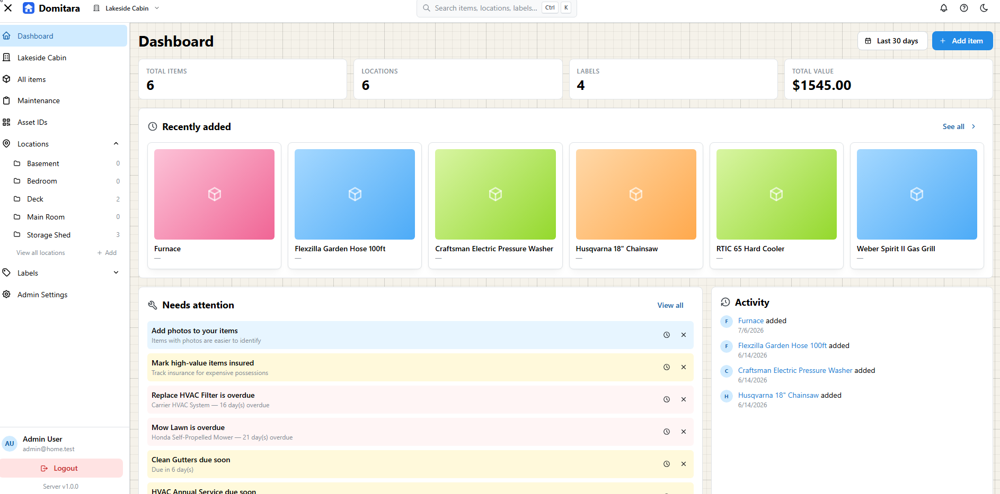

# Domitara

**Self-hosted home inventory & management** — a modern replacement for [Homebox](https://github.com/hay-kot/homebox).

[](https://github.com/domitara/domitara/actions/workflows/pr-checks.yml)
[](https://domitara.github.io/domitara/)
[](https://github.com/domitara/domitara/releases)
[](https://github.com/domitara/domitara/pkgs/container/domitara)
[](./LICENSE)

Catalog everything you own — photos, documents, purchase info, serial numbers, warranties, and custom fields — organized by home, room/location, and label. Track maintenance schedules, map electrical panels, and manage multiple properties with per-user roles, all from a self-hosted web app or the native Android companion.

📖 **Full documentation:** https://domitara.github.io/domitara/



## Features

- **Inventory tracking** — Catalog items with photos, documents, purchase info, serial numbers, and free-form custom fields
- **Locations & Labels** — Organize items by a room/container tree, and tag them with color-coded labels
- **Asset IDs** — Auto-generated codes for physical items, ready for printed labels
- **Maintenance** — Reminders, recurring schedules, and a log of completed work
- **Electrical panels** — Map circuit breakers, subpanels, and floor plan areas; print a breaker directory
- **Homes & Members** — Track multiple properties, invite members, and store home-level photos and documents
- **Mobile app** — Native Android companion app (Kotlin / Jetpack Compose)
- **Multi-user** — Admin and member roles with per-user access

## Quick start

The fastest way to run Domitara is with Docker:

```bash
docker run -d \
  -e DATABASE_URL=postgres://... \
  -e JWT_SECRET=your-secret \
  -p 8080:8080 \
  ghcr.io/domitara/domitara:latest
```

For the full setup guide (including environment variables and reverse proxy notes), see [Installation](https://domitara.github.io/domitara/getting-started/installation) in the docs.

## Tech stack

| Component | Stack |
|---|---|
| API | Go, [huma](https://github.com/danielgtaylor/huma), chi, pgx, PostgreSQL |
| Web | React 19, TanStack Router/Query, Mantine |
| Mobile | Native Android — Kotlin, Jetpack Compose |
| Docs | Docusaurus |

This is a monorepo managed with pnpm workspaces + Turborepo; the API and web app build into a single deployable binary/image.

## Local development

See [`CLAUDE.md`](./CLAUDE.md) for repo conventions, or get started quickly with the [Taskfile](./Taskfile.yml):

```bash
task setup     # install dependencies
task db:up     # start dev postgres
task db:migrate
task dev       # run API + web with hot reload
```

## License

[MIT](./LICENSE)
